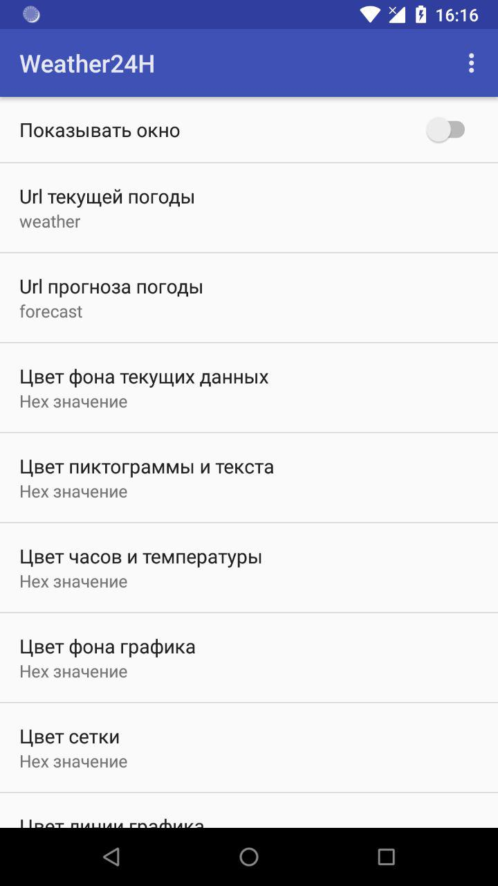
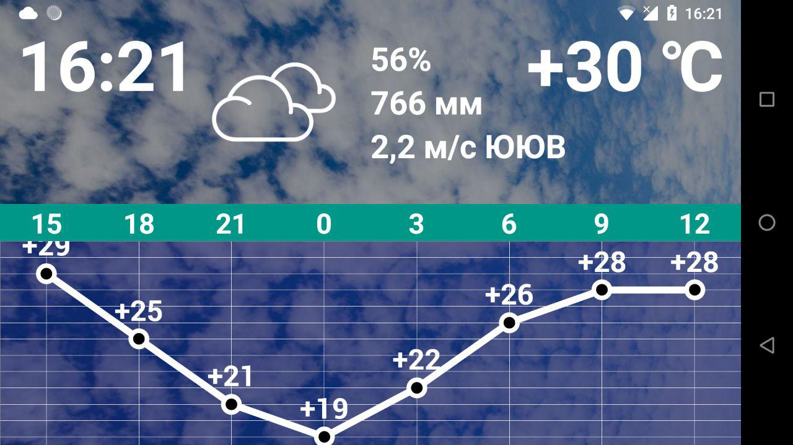

# Weather24H
> Android weather :sunny: :umbrella: :cloud: app powered by OpenWeatherMap.org

  

There is a preference screen to customize colors (with alpha available e.g. #80000000) and urls

Setup the last with your own api key

Enjoy! :sun_with_face:

Screenshots:

